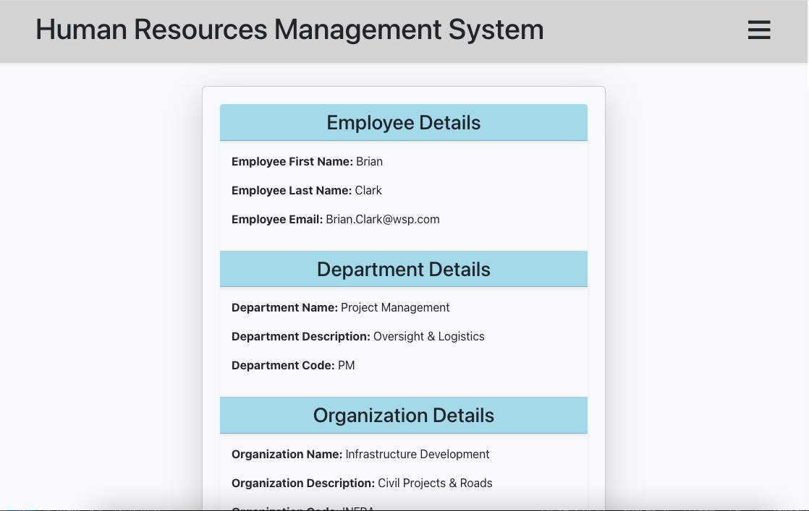

# HR Management System with Cloud Native Principles

## Description

An HR Management System allowing employers to administrate workforce data 
built with Spring Boot, Spring Cloud, Java and MySQL that 
embraces cloud-native principles. Built with Domain Driven Design 
the application utilizes a microservices architecture to enhance 
scalability and maintainability. 

### Communication, Security and Resource Management

Microservice communication 
is achieved through Spring Cloud Open Feign, while Eureka and Service 
Discovery is used to manage and locate services. Spring Cloud Gateway ensures 
security and optimized resource allocation 
facilitating client request routing and load balancing.

### Configuration, Monitoring and Stability

Spring Cloud Config Server provides centralized externalized 
configuration management, loading config files from a [Git repository](https://github.com/AnnaAxelsson051/Config-Server-repo). 
Spring Cloud Bus simplifies 
broadcasting configuration changes and events across multiple microservice 
instances for streamlined configuration updates and RabbitMQ is used as a 
message broker to facilitate smooth communication between 
microservices. Spring Cloud Sleuth enables distributed tracing, facilitating monitoring and 
analysis of request flows. Additionally the Circuit Breaker pattern, 
implemented through Spring Cloud Circuit Breaker with resilience4j, 
further enhances system stability.

---

## User Interface

---

## Tech Stack
- Spring Boot
- Java
- RESTful web services
- Spring Data Jpa
- MySQL
- Spring Cloud Open Feign
- Spring Cloud Gateway
- Spring Cloud Config Server
- Spring Cloud Bus
- RabbitMQ
- Docker
- Spring Cloud Sleuth
- Spring Cloud Circuit
- Resilience4j
- React
- Bootstrap

## Architectural Principles
- Cloud Native
- Eureka and Service Discovery
- Domain Driven Design
- MVC
- Microservices
- Circuit Breaker Pattern

